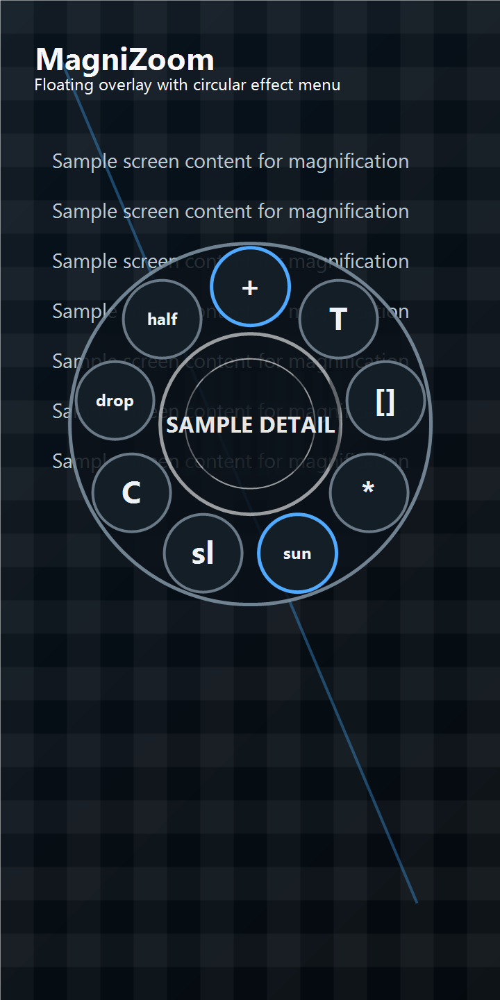
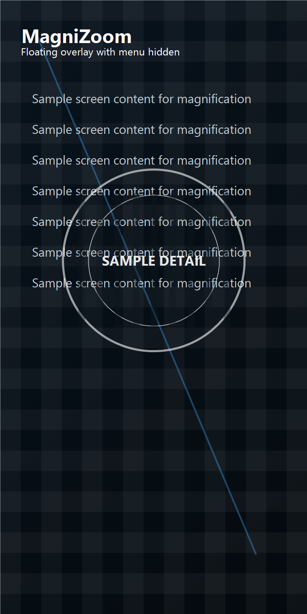
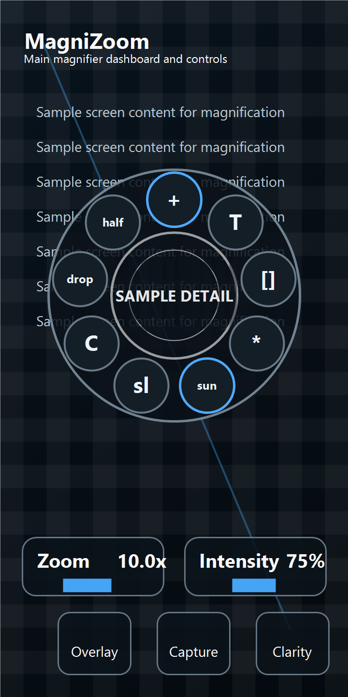
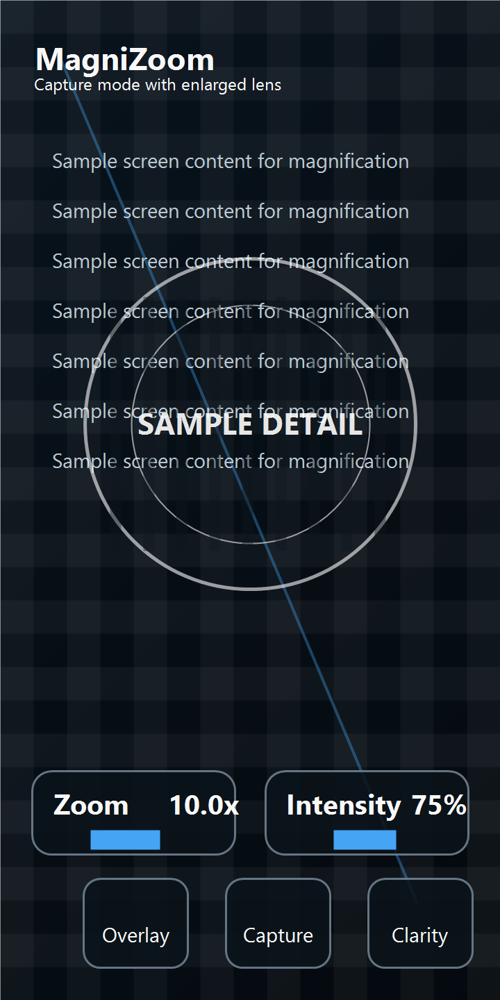

# MagniZoom

MagniZoom is a prototype Android magnifier app built with Kotlin and Jetpack Compose. It provides a circular magnifier dashboard, a floating draw-over-other-apps overlay, camera and screen-capture modes, zoom controls, and stackable visual filters for reading small details.

> Prototype status: this app is under active development. Core overlay and magnifier flows are usable, but APIs and UX details may still change.

## Screenshots

Privacy-safe app previews live in `docs/screenshots/` and show the current magnifier and overlay prototype without real device, account, or third-party app content.

| Overlay Menu | Overlay Lens |
| --- | --- |
|  |  |

| Main Magnifier | Capture Zoom |
| --- | --- |
|  |  |

## Demo Videos

Compressed, metadata-stripped demo recordings live in `docs/videos/`. The raw source recordings are not committed.

- [Main magnifier demo](docs/videos/main-magnifier-demo.mp4)
- [Overlay target-app demo](docs/videos/overlay-target-app-demo.mp4)

## Features

- Circular magnifier lens with a rotating effect wheel.
- Floating overlay using Android draw-over-other-apps permission.
- Double-tap overlay lens to show or hide the circular menu.
- Drag overlay lens to move it around the screen.
- Resize handle for changing overlay size.
- Stackable visual filters, including text boost, edge detail, low light, color detail, monochrome, invert, and high contrast.
- Camera preview mode from the main magnifier screen.
- Screen capture and target-app capture flows for overlay magnification.
- Zoom up to 10x, including pinch zoom support.
- History and settings prototype screens.

## Requirements

- Android Studio with Android Gradle Plugin support.
- JDK 11 or newer.
- Android SDK 36.
- Android 5.0+ device or emulator.
- A physical Android device is recommended for overlay and screen-capture testing.

## Build

Clone the project and build the debug APK:

```powershell
.\gradlew.bat :app:assembleDebug
```

Install on a connected device:

```powershell
.\gradlew.bat :app:installDebug
```

Run tests:

```powershell
.\gradlew.bat :app:testDebugUnitTest
```

## Permissions

MagniZoom uses these Android permissions:

- `SYSTEM_ALERT_WINDOW` for the floating overlay.
- `FOREGROUND_SERVICE`, `FOREGROUND_SERVICE_SPECIAL_USE`, and `FOREGROUND_SERVICE_MEDIA_PROJECTION` for the overlay and capture service.
- `POST_NOTIFICATIONS` for foreground service notification behavior on newer Android versions.
- `CAMERA` for camera magnifier mode.

Screen capture uses Android MediaProjection consent. The app should not capture protected content, and some apps may block capture output.

## Project Structure

```text
app/src/main/java/com/boredjejemonph/magnizoom/
  MainActivity.kt
  MagniZoomApp.kt
  MagnifierOverlayService.kt
  ScreenCapturePermissionActivity.kt
  OverlayCaptureMode.kt
```

Most UI is implemented in `MagniZoomApp.kt`. The floating overlay service and capture pipeline live in `MagnifierOverlayService.kt`.

## Roadmap

- Improve capture mode onboarding and permissions copy.
- Add persistent user settings.
- Add real saved captures/history.
- Add instrumented UI tests for overlay behavior.
- Polish release build configuration and app icon branding.

## Contributing

Contributions are welcome. See [CONTRIBUTING.md](CONTRIBUTING.md) for setup and contribution guidelines.
Participation is covered by the project [Code of Conduct](CODE_OF_CONDUCT.md).

## License

This project is licensed under the MIT License. See [LICENSE](LICENSE).
